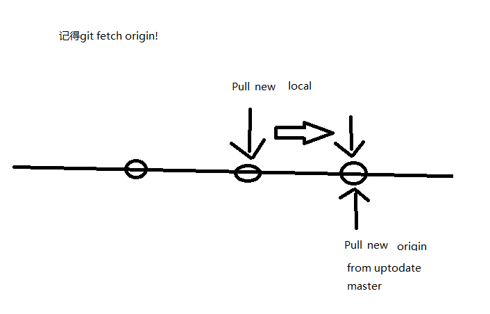

# 在vscode中使用git

## 切换分支：

1. 点击源代码管理的BRANCHES，点击需要的分支；
2. 若需要切换到远程分支，点击左下角蓝色条上的分支图标，弹出搜索框，搜索需要的分支（全称，点击回车）即可在BRANCHES里看到了

* 问题：2. 中如果搜索输入没有自动下拉显示对应的分支时，可能因为还是没有找到远程分支，这时候敲回车貌似是创建了本地分支，push时还是需要建立远程连接。见下图所示。

* 验证结果：确实！没有更新到最新的分支信息，需要在git bash执行git fetch origin
* vscode获取最新的分支信息：

1. 设置git.autofetch为true，这样vscode会定期自动从远程更新分支信息（暂时体会不到什么作用，也没有看到新建的远程分支）
2. ctrl+shift+p，调出输入框，输入git fetch选择“Git: 从所有远程存储库中拉取”，然后就可以看到所有远程分支了

### 流程整理：

1. 若开发过该分支，在源代码管理的BRANCHES可找到并进行切换
2. 若BRANCHES中没有，点击蓝色条图标进行搜索，出现对应的远程分支名（origin/branch_name）点击即可切换
3. 若没有对应的远程分支名，先获取最新的分支信息，再执行此操作

