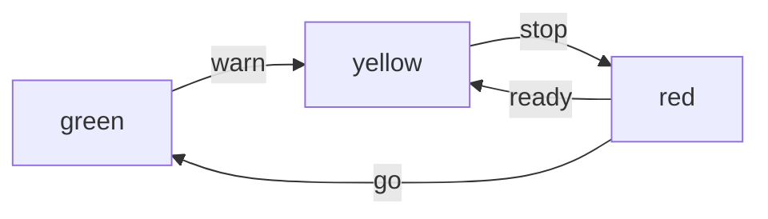

## Javascript与有限状态机

参考来源：[阮一峰_Javascript与有限状态机](http://www.ruanyifeng.com/blog/2013/09/finite-state_machine_for_javascript.html)

### 使用意义

> 封装具有明显状态轮转的对象或事物，如红绿灯、开关

### 基本框架

> 状态、事件绑定

```javascript
// frame
var finiteStateMachine = {
    // 当前状态
    currentState: 0
    
    // 绑定事件
    initialize: function() {
        this.on('event', fn)
    }
}
```

### 相关便捷库

* javascript-state-machine

```shell
npm install [--save[-dev]] javascript-state-machine
```

> 生成的时候，需要提供一个参数对象，用来描述实例的性质。

```javascript
var fsm = StateMachine.create({
　　
    initial: 'green',

    events: [
        { name: 'warn',  from: 'green',  to: 'yellow' },
        { name: 'stop', from: 'yellow', to: 'red' },
        { name: 'ready',  from: 'red',    to: 'yellow' },
        { name: 'go', from: 'yellow', to: 'green' }
    ],
    
    error: function(eventName, from, to, args, errorCode, errorMessage) {
        // doSomething
    }

});
```



> 查询接口：
>
> 1. fsm.current  返回当前状态
> 2. fsm.is(s)  返回s是否为当前状态
> 3. fsm.can(e)  返回事件e是否能在当前状态出发
> 4. fsm.cannot(e)  返回事件e是否不能在当前状态出发

> 事件：
>
> 1. onbeforeevent / onbefore${event_name}  事件前触发
> 2. on[after]event / on[after]${event_name}  事件后触发
> 3. onleavestate / onleave${state_name}  离开状态前触发
> 4. on[enter]state / on[enter]${state_name}  进入状态时触发

> 等回调函数异步操作结束：
>
>  fsm.transition();

## base64编码

参考：[CSDN@DeMonnnnnn_JS将图片转为base64编码](https://demon.blog.csdn.net/article/details/79731359?spm=1001.2101.3001.6650.1&utm_medium=distribute.pc_relevant.none-task-blog-2%7Edefault%7ECTRLIST%7Edefault-1.pc_relevant_default&depth_1-utm_source=distribute.pc_relevant.none-task-blog-2%7Edefault%7ECTRLIST%7Edefault-1.pc_relevant_default&utm_relevant_index=2)

## input/textarea光标

[@刺猬先生 | 关于input和textarea文本框光标定位问题](https://16bing.com/2018/01/09/input-textarea-cursor-position/)

## JSBridge

[CSDN@lovenjoe | 移动混合开发中的JSBridge](https://blog.csdn.net/lovenjoe/article/details/78423616)

[CSDN@语记时光 | JSBridge原理与实现分析](https://blog.csdn.net/qq_30868289/article/details/104233030)

## 正则表达式

如：`/^[^,\\]+[,\\\s]+(.+?)\s*(\d{5})?$/`

语法参考：

- `.` - 除换行符以外的所有字符。
- `^` - 字符串开头。
- `$` - 字符串结尾。
- **`\d`,`\w`,`\s`** - 匹配数字、字符、空格。
- **`\D`,`\W`,`\S`** - 匹配非数字、非字符、非空格。
- `[abc]` - 匹配 a、b 或 c 中的一个字母。
- `[a-z]` - 匹配 a 到 z 中的一个字母。
- `[^abc]` - 匹配除了 a、b 或 c 中的其他字母。
- `aa|bb` - 匹配 aa 或 bb。
- `?` - 0 次或 1 次匹配。
- `*` - 匹配 0 次或多次。
- `+` - 匹配 1 次或多次。
- `{\*n\*}` - 匹配 *n*次。
- `{\*n\*,}` - 匹配 *n*次以上。
- `{\*m\*,\*n\*}` - 最少 *m* 次，最多 *n* 次匹配。
- **`(`\*expr\*`)`** - 捕获 *expr* 子模式,以 `\1` 使用它。
- **`(?:`\*expr\*`)`** - 忽略捕获的子模式。
- **`(?=`\*expr\*`)`** - 正向预查模式 *expr*。
- **`(?!`\*expr\*`)`** - 负向预查模式 *expr*。

## 六大设计原则

### 里氏替换原则

## jsmind

> 用js构建思维导图

[jsmind主页官网](http://hizzgdev.github.io/jsmind/developer.html)

[Github_jsmind](https://github.com/beginor/jsmind)

## JS测试框架

